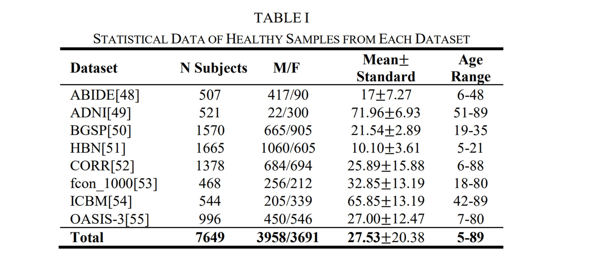

# A Lightweight 2D Projection CNN Framework for MRI-Based Brain Age Prediction

<div align="center">


*An efficient deep learning framework for brain age estimation using 2D projection strategies*

[Paper](#citation) | [Installation](#installation) | [Quick Start](#quick-start) | [Results](#results)

</div>

---

## Table of Contents

- [Overview](#overview)
- [Key Features](#key-features)
- [Project Structure](#project-structure)
- [Installation](#installation)
- [Dataset](#dataset)
- [Methodology](#methodology)
  - [2D Projection Strategy](#2d-projection-strategy)
  - [Model Architecture](#model-architecture)
- [Results](#results)
- [Visualization](#visualization)
- [Quick Start](#quick-start)
- [Limitations](#limitations)
- [Citation](#citation)

---

## Overview

Brain age serves as a crucial biomarker for quantifying age-related structural changes in the human brain, offering potential for early disease diagnosis and healthy aging monitoring. This project presents a **computationally efficient deep learning framework** that achieves state-of-the-art performance while being significantly faster than traditional 3D CNN approaches.

### Why This Matters

- **Efficiency**: 2 orders of magnitude faster training than 3D CNNs (~1.5h vs 72-332h)
- **Lightweight**: 86% fewer parameters than SFCN (414k vs 3M)
- **Accurate**: MAE of 2.50 years on ensemble model
- **Interpretable**: Grad-CAM visualizations confirm biologically plausible attention patterns

---

## Key Features

| Feature | Description |
|---------|-------------|
| Multi-Modal 2D Projections | Combines T1 MR images and gray matter probability maps |
| Lightweight Architecture | Only 414,785 parameters with 3 convolutional blocks |
| Bias Correction | Age-distribution weighted training reduces systematic errors |
| Biological Validation | Grad-CAM highlights age-relevant brain regions |
| Multi-Plane Ensemble | Combines axial, coronal, and sagittal views |

---

## Project Structure

```
2D_Proj_CNN/
├── 2D_Projection/              # Projection generation modules
│   ├── projection_mean.py      # Mean projection
│   ├── projection_std.py       # Standard deviation projection
│   ├── projection_max.py       # Maximum projection
│   ├── projection_median.py    # Median projection (core slices)
│   ├── merge_projections.py    # Merge 6 channels
│   └── pipeline.py             # Complete projection pipeline
│
├── Preprocessing/              # MRI preprocessing pipeline
│   ├── n4_correction.py        # N4 bias field correction
│   ├── brain_extraction.py     # Skull stripping (ANTsXNet)
│   ├── mni_registration.py     # MNI152 registration
│   ├── normalization.py        # Z-score & Min-Max normalization
│   └── preprocessing_pipeline.py  # Complete preprocessing pipeline
│
├── Modeling/                   # Model training & evaluation
│   └── Modeling(coronal).ipynb # Training notebook
│
├── images/                     # Documentation figures
│   ├── 投影片1.JPG
│   ├── 投影片2.JPG
│   ├── 投影片3.JPG
│   └── 投影片4.JPG
│
├── environment.yml             # Conda environment
└── README.md                   # This file
```

---

## Installation

### Prerequisites

- Python 3.8+
- CUDA 11.3+ (for GPU support)
- Conda or Miniconda

### Setup Environment

```bash
# Clone the repository
git clone https://github.com/1leo23/A-Lightweight-2D-Projection-CNN-Framework-for-MRI-Based-Brain-Age-Prediction.git
cd A-Lightweight-2D-Projection-CNN-Framework-for-MRI-Based-Brain-Age-Prediction

# Create conda environment
conda env create -f environment.yml
conda activate ants_brain

# Verify installation
python -c "import ants; import torch; print('Setup successful!')"
```

---

## Dataset

We aggregated **eight publicly available datasets** with **7,649 healthy participants** (aged 5–89 years):
<div align="center">




</div>

### Preprocessing Pipeline

All preprocessing can be executed via:
```bash
python Preprocessing/preprocessing_pipeline.py
```

**Pipeline Steps:**
1. N4 bias field correction
2. Skull stripping (ANTsXNet)
3. Nonlinear registration to MNI152 template
4. Intensity normalization (Z-score)
5. Gray matter probability map generation (FSL FAST)

---

## Methodology

### 2D Projection Strategy

For each MRI scan, we generate **6 types of 2D projections** across **3 anatomical planes**:

<div align="center">


</div>

#### Projection Types

**For T1 MR Images:**
- **Mean**: Average intensity across slices → preserves global structure
- **Std**: Standard deviation → captures tissue heterogeneity
- **Max**: Maximum intensity → highlights high-contrast features

**For Gray Matter Probability Maps:**
- **Mean**: Average probability across all slices
- **Std**: Variability in gray matter distribution
- **Median**: Robust central tendency (slices 40-140 only)

**Rationale for Using Both:**
1. Mean provides global information including peripheral regions
2. Median focuses on core brain structures, reducing noise
3. Combined, they offer complementary statistical perspectives

#### Generate Projections

```bash
# Run complete projection pipeline
python 2D_Projection/pipeline.py
```

**Output:** `(6 × 218 × 218)` tensor per anatomical plane

---

### Model Architecture

<div align="center">


</div>

#### Architecture Details

```
Input: 6×218×218 tensor

Conv Block 1: [3×3 Conv → BN → ReLU → MaxPool] → 64 channels
Conv Block 2: [3×3 Conv → BN → ReLU → MaxPool] → 128 channels  
Conv Block 3: [3×3 Conv → BN → ReLU] → 256 channels (no pooling)

Global Average Pooling → 256 features
Concatenate with sex → 257 features

FC1: 257 → 128 (ReLU + Dropout 0.2)
FC2: 128 → 64 (ReLU)
FC3: 64 → 1 (Age prediction)
```

**Total Parameters:** 414,785 (86% fewer than SFCN's 3M)

#### Training Strategy

- **Optimizer:** Adam with OneCycleLR scheduler
- **Loss Functions:** 
  - Baseline: MAE loss
  - Weighted: Age-distribution weighted MAE
- **Ensemble:** Average predictions from 3 planes (axial, coronal, sagittal)

#### Train the Model

```bash
# Open Jupyter notebook
jupyter notebook Modeling/Modeling(coronal).ipynb
```

---

## Results

### Performance Comparison

<div align="center">


</div>

### Key Achievements

- **Better Accuracy:** MAE 2.50 vs 3.53 (Jönemo et al., 2023)
- **Parameter Efficiency:** 414k parameters vs 3M (SFCN) - 86% reduction(Peng et al., 2021)
- **Compact Model:** Comparable performance to models with 70M+ parameters (Lee et al., 2022)
- **Reduced Bias:** Weighted training significantly reduces systematic errors across age groups

---

## Visualization

### Grad-CAM Heatmaps

<div align="center">


</div>

#### Biological Validation

| Age Group | Attention Pattern | Biological Interpretation |
|-----------|-------------------|---------------------------|
| **Children/Adolescents** | Cerebellum | Motor development & coordination |
| **Young Adults** | Cortical regions | Peak cognitive function |
| **Middle-Elderly** | Ventricles & Hippocampus | Age-related atrophy patterns |

These patterns **align with known neuroscience** of aging, validating our model's interpretability.

---

## Quick Start

### End-to-End Pipeline

```bash
# 1. Preprocess your MRI data
python Preprocessing/preprocessing_pipeline.py

# 2. Generate 2D projections
python 2D_Projection/pipeline.py

# 3. Train the model
jupyter notebook Modeling/Modeling(coronal).ipynb
```

### Using Pre-trained Models

```python
import torch
from modeling.model import BrainAgeModelWithSex

# Load trained model
model = BrainAgeModelWithSex()
model.load_state_dict(torch.load('path/to/fold1_mae_best.pth'))
model.eval()

# Predict brain age
predicted_age = model(image_tensor, sex_tensor)
```

---

## Limitations

While our framework achieves strong performance, several limitations should be noted:

1. **Sample Distribution**
   - Fewer middle-aged (30–49) and elderly (≥80) samples
   - May affect prediction accuracy in these age ranges

2. **Population Diversity**
   - Training data predominantly from Western cohorts
   - Generalization to diverse ethnicities requires validation

3. **Clinical Validation**
   - Trained only on healthy controls
   - Performance on pathological cases (e.g., Alzheimer's, Parkinson's) is unknown

4. **Information Loss**
   - 2D projections may miss subtle 3D structural patterns
   - Trade-off between efficiency and completeness

---

## Citation

**Note:** This research is currently in preparation for submission to IEEE Access. Citation information will be available upon publication.

- **Citation Key:** chang2025brainage
- **Title:** A Lightweight 2D Projection CNN Framework for MRI-Based Brain Age Prediction
- **Authors:** Chang, Ting-An and Syu, Ruei-Chun
- **Journal:** IEEE Access
- **Status:** Under review
- **Year:** 2025

---

## Contact

For questions or collaborations:

- **Email:** forever70426@gmail.com
- **GitHub:** [@1leo23](https://github.com/1leo23)
- **Repository:** [A-Lightweight-2D-Projection-CNN-Framework-for-MRI-Based-Brain-Age-Prediction](https://github.com/1leo23/A-Lightweight-2D-Projection-CNN-Framework-for-MRI-Based-Brain-Age-Prediction)